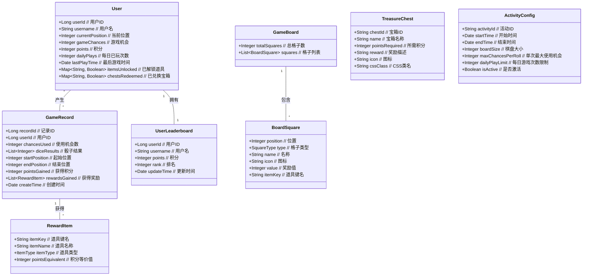

# 跳跳棋活动系统架构设计

## 目录

- [跳跳棋活动系统架构设计](#跳跳棋活动系统架构设计)
  - [目录](#目录)
  - [1. 系统架构概述](#1-系统架构概述)
    - [整体架构](#整体架构)
    - [技术栈选择](#技术栈选择)
  - [2. 微服务架构](#2-微服务架构)
    - [微服务职责划分](#微服务职责划分)
  - [3. 核心领域模型](#3-核心领域模型)
    - [类图（核心领域对象）](#类图核心领域对象)
    - [核心枚举定义](#核心枚举定义)
  - [4. 数据库设计](#4-数据库设计)
    - [ER图](#er图)
    - [宽表设计说明](#宽表设计说明)
  - [5. 业务流程设计](#5-业务流程设计)
    - [跳跳棋游戏流程](#跳跳棋游戏流程)
    - [宝箱兑换流程](#宝箱兑换流程)
    - [排行榜更新流程](#排行榜更新流程)
  - [6. 接口交互设计](#6-接口交互设计)
    - [系统间通信模式](#系统间通信模式)
    - [消息事件设计](#消息事件设计)
  - [7. 关键技术实现](#7-关键技术实现)
    - [数据一致性保证](#数据一致性保证)
    - [高频排行榜优化方案](#高频排行榜优化方案)

## 1. 系统架构概述

跳跳棋活动系统是一个基于Java微服务架构的营销活动平台，用于提升用户送礼消耗和平台活跃度。系统核心功能包括跳跳棋游戏、宝箱兑换和活动排行榜。

### 整体架构

### 技术栈选择

- **后端框架**：Spring Boot + Spring Cloud
- **消息队列**：RabbitMQ/Kafka
- **数据库**：MySQL (主要业务数据) + Redis (缓存、排行榜)
- **服务发现与注册**：Eureka/Nacos
- **API网关**：Spring Cloud Gateway
- **监控**：Spring Boot Admin + Prometheus + Grafana
- **日志**：ELK (Elasticsearch, Logstash, Kibana)
- **容器化部署**：Docker + Kubernetes

## 2. 微服务架构

跳跳棋活动系统采用微服务架构，将系统功能拆分为多个独立的微服务。

### 微服务职责划分

1. **游戏微服务 (Game Service)**
   - 管理游戏核心逻辑
   - 处理掷骰子、角色移动、奖励发放等功能
   - 维护用户游戏进度和状态

2. **奖励微服务 (Reward Service)**
   - 管理宝箱和积分兑换
   - 处理奖励发放逻辑

3. **排行榜微服务 (Leaderboard Service)**
   - 维护和更新用户积分排行榜
   - 实时计算排名

4. **配置微服务 (Config Service)**
   - 管理游戏配置、宝箱配置等
   - 提供配置参数接口

## 3. 核心领域模型

### 类图（核心领域对象）

### 核心枚举定义

## 4. 数据库设计

系统采用宽表模式设计数据库，减少表间关联，优化查询性能。

### ER图

### 宽表设计说明

1. **ACTIVITY_USER表**：
   - 保存用户在活动中的状态数据
   - 使用JSON字符串存储解锁道具和已兑换宝箱等集合数据
   - 避免多表关联，提高查询效率

2. **GAME_RECORD表**：
   - 记录用户每次游戏的详细信息
   - 使用JSON字符串存储骰子结果和奖励信息

3. **配置表**：
   - BOARD_CONFIG、CHEST_CONFIG、ITEM_CONFIG等表存储活动配置
   - 使用activity_id关联特定活动实例

4. **USER_LEADERBOARD表**：
   - 存储用户排行榜数据
   - 定期更新rank字段，避免实时排序